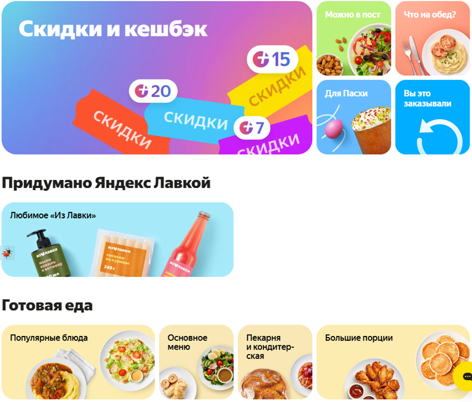
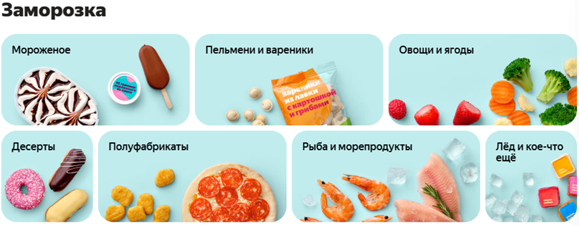
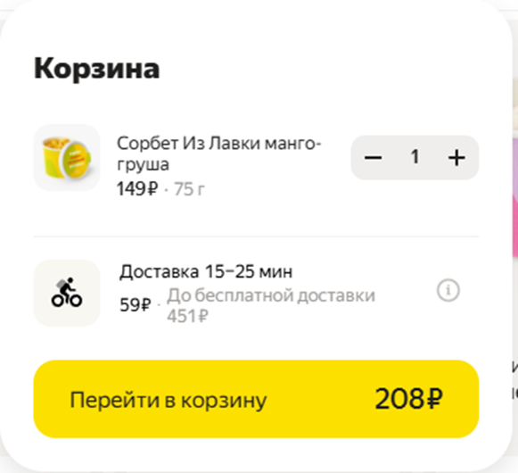
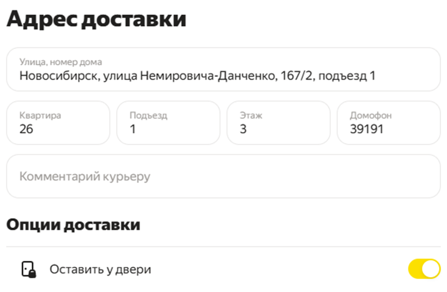
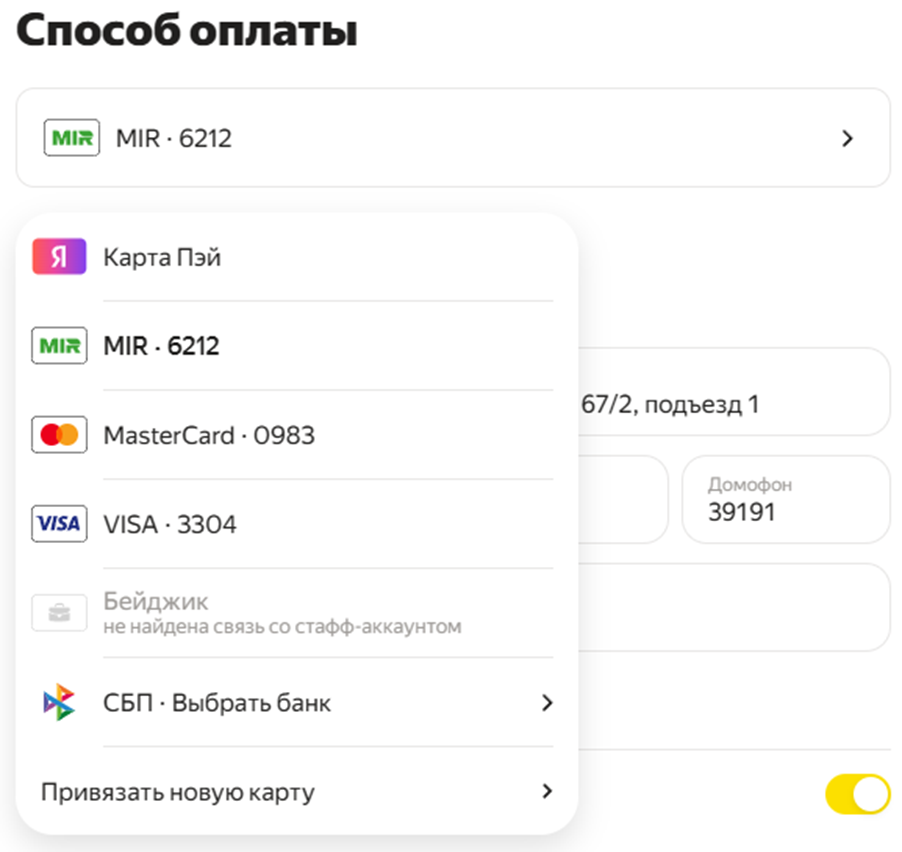
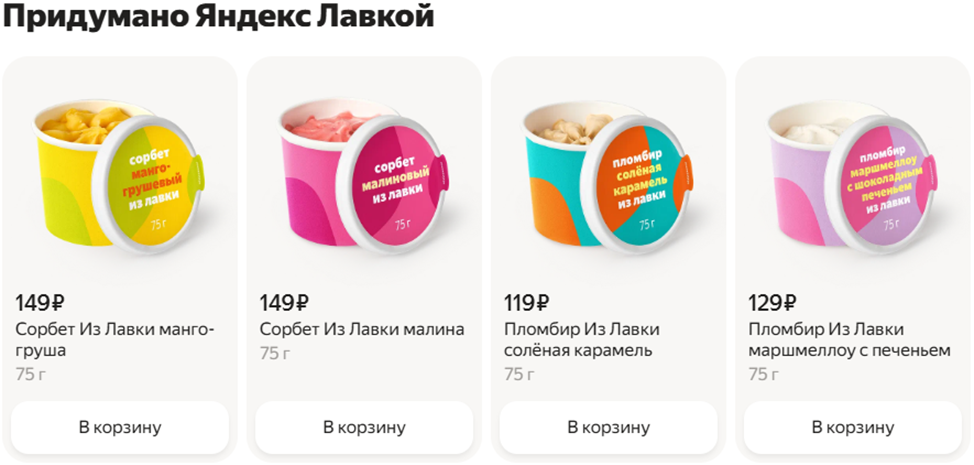
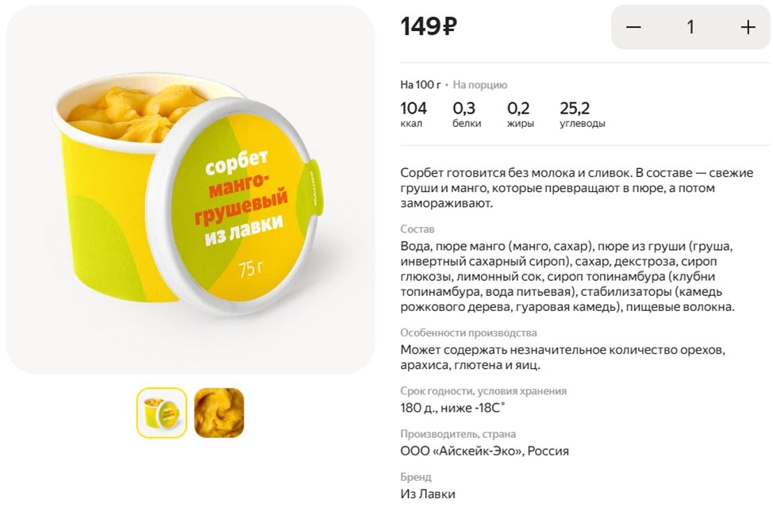

# Как выбрать и заказать мороженое в лавке?

1.	Скачайте приложение Яндекс Лавка на IOS или Android либо зайдите на сайт **lavka.yandex.ru**

 

2.	Зарегистрируйтесь или войдите в существующий аккаунт.
3.	Перейдите в категорию «Заморозка» —> «Мороженое».
 
 

4.	Выберите понравившиеся позиции и добавьте их в корзину.
 
 

 
5.	Оформите заказ, указав адрес доставки, удобное время и дополнительную необходимую информацию.

 

 
6.	Оплатите заказ онлайн сохранённой картой или другим способом.
 
 

7.	Отслеживайте статус заказа через приложение или с помощью голосового помощника, привязанного к аккаунту, спросив «Алиса, где мой заказ?»

### Выбор мороженного:
1.	В Лавке представлен широкий выбор различных видов и брендов мороженого, включая товары под собственным брендом «Из лавки».

 

 
2.	Ознакомьтесь с описанием, составом и ценой продукта, выбирайте по своим вкусам и предпочтениям.

 

 
3.	Выбирайте мороженое с натуральным составом: молоко, сливки, фрукты и натуральные ароматизаторы — без лишних добавок.

4. Выбирайте по вкусу и текстуре — кремовое, сорбет, пломбир или эскимо — чтобы наслаждение было полным!

### Рекомендации:
1.	В случае проблем с качеством товара следует обратиться в службу поддержки, опишите свою проблему и приложите фото при необходимости.
2.	Проверьте стоимость доставки, она зависит от погодных условий и времени суток.

